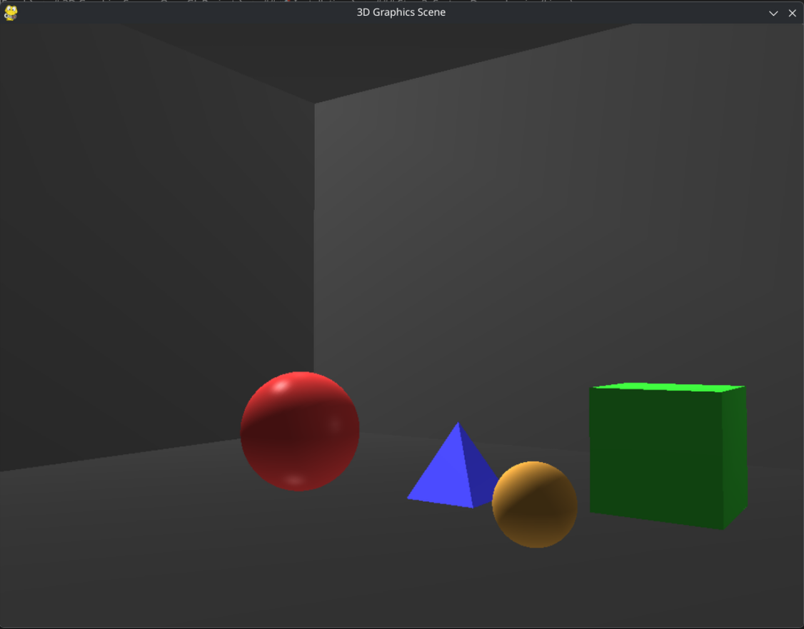
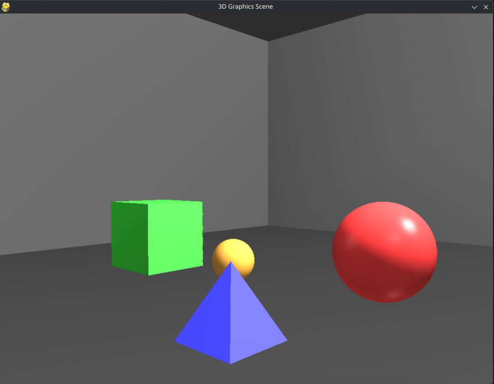

# 3D Graphics Scene - OpenGL Project

This project is an interactive 3D graphics scene developed using OpenGL and Pygame libraries in Python. The project includes 3D objects with different materials (sphere, cube, pyramid), a dynamic lighting system, and first-person camera control.

## 📋 Features

- **3D Objects**: Geometric shapes such as sphere, cube, and pyramid
- **Advanced Lighting System**:
  - Rotating light source (GL_LIGHT0)
  - Directional light (GL_LIGHT1)
  - Two point light sources (GL_LIGHT2, GL_LIGHT3)
  - Dynamic light intensity control
- **Different Material Types**:
  - `polished_metal` - Shiny metal surface
  - `rough_plastic` - Matte plastic surface
  - `reflective_glass` - Reflective glass surface
  - `brushed_metal` - Brushed metal
  - `mat_material` - Completely matte surface
- **First-Person Camera Control**:
  - Mouse-based view direction control
  - WASD keys for movement
  - Real-time camera movement
- **Enclosed Room Environment**: A dark room with 8x8 unit dimensions

## � Screenshots

### Scene Overview


### Lighting and Materials


## �🚀 Installation

### Requirements

- Python 3.14 or higher
- uv or pip

### Step 1: Download the Project

```bash
git clone <repository-url>
cd ComputerGraphics
```

### Step 2: Install Dependencies

```bash
pip install numpy pygame PyOpenGL PyOpenGL_accelerate
```

### Step 3: System Dependencies (Linux)

For Ubuntu/Debian:

```bash
sudo apt update
sudo apt install libglu1-mesa-dev freeglut3-dev mesa-common-dev libgl1-mesa-dev
sudo apt install libsdl2-dev libsdl2-image-dev libsdl2-mixer-dev libsdl2-ttf-dev
```

## Usage

To run the program:

```bash
python main.py
```

### Controls

#### Camera Movement
- **W** - Move forward
- **S** - Move backward
- **A** - Move left
- **D** - Move right
- **Mouse** - Change view direction

#### Light Control
- **Numpad 4** - Rotate light left
- **Numpad 6** - Rotate light right
- **Mouse Wheel** - Increase/decrease light intensity

#### Other
- **ESC** - Exit program

## Project Structure

```
ComputerGraphics/
│
├── main.py                 # Main entry point
├── scene.py                # Scene management and render loop
├── graphics_utils.py       # Graphics utility functions
├── pyproject.toml          # Project dependencies
├── README.md               # This file
└── pictures/            # 
```

### File Descriptions

#### `main.py`
The program's entry point. Initializes the `AdvancedGraphicsScene` class and calls the `run()` method.

#### `scene.py`
- **AdvancedGraphicsScene**: Main scene class
  - Camera management
  - Lighting system setup
  - Render loop
  - User input processing
  - 3D object management

**Important Methods:**
- `setup_lights()`: Configures all light sources
- `handle_camera_movement()`: Processes user inputs and moves the camera
- `render()`: Draws the scene every frame
- `add_object()`: Adds a new 3D object to the scene

#### `graphics_utils.py`
- **GraphicsUtils**: Class containing static utility methods
  - `set_material()`: Sets material properties (ambient, diffuse, specular, shininess)
  - `draw_room()`: Draws the enclosed room environment
  - `draw_sphere()`: Draws a sphere using GLU library
  - `draw_cube()`: Draws a cube with vertices and normal vectors
  - `draw_pyramid()`: Draws a pyramid with triangular faces

## 🔧 Technical Details

- **Resolution**: 1024x768 (by default)
- **Anti-aliasing**: Enabled (GL_SMOOTH)

### Lighting Model

The project uses the Phong lighting model:

- **Ambient**: Indirect light
- **Diffuse**: Determines surface matteness
- **Specular**: Shiny spots
- **Shininess**: Shininess degree (0-128)

### Camera System

- **FOV**: 45°
- **Near Plane**: 0.1 units
- **Far Plane**: 100.0 units
- **Movement Speed**: 2.0 units/second
- **Mouse Sensitivity**: 0.15

##  Material Properties

| Material | Ambient | Diffuse | Specular | Shininess |
|----------|---------|---------|----------|-----------|
| polished_metal | Low | Low | Very High | 100.0 |
| rough_plastic | Low | Medium | None | 5.0 |
| reflective_glass | Very Low | Low | Low | 70.0 |
| brushed_metal | Low | Low | Low | 5.0 |
| mat_material | Low | Low | None | 0.0 |

### Window not opening / Black screen
- Update your GPU drivers
- Make sure you have OpenGL 2.1 or higher support
- Check that Mesa libraries are installed

- OpenGL and PyOpenGL documentation
- Pygame community
